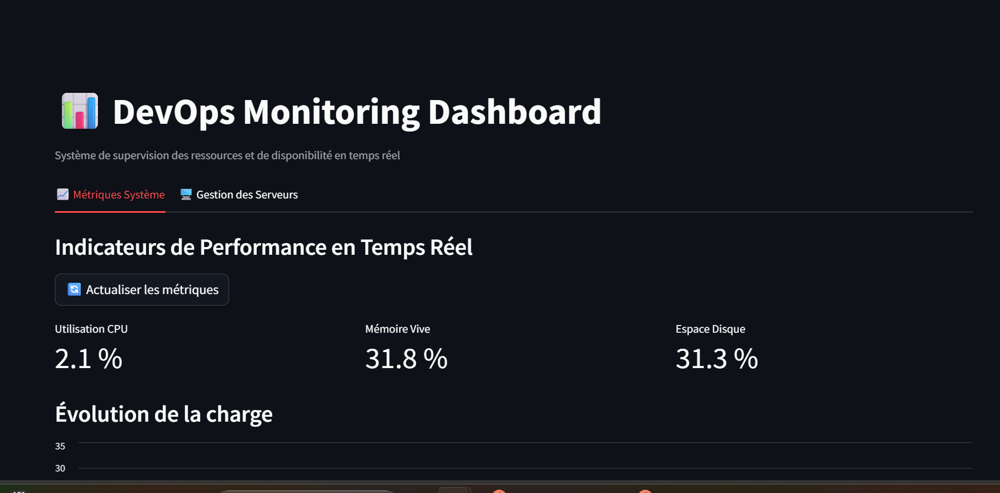
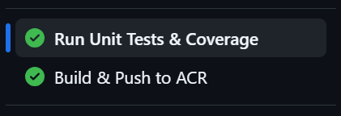
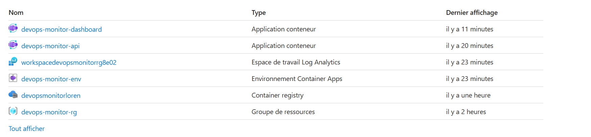

# Projet Final — DevOps Monitoring Dashboard

### Python from Beginner to Practitioner for DevOps — SupdeVinci

**Auteur :** Lorenzo Sperisen
**Version :** `v1.0.0` (Production Release)

---

## 🚀 Liens de Production (Azure Cloud)

L'infrastructure a été entièrement conteneurisée et déployée sur l'environnement Cloud d'**Azure Container Apps (ACA)**. La pipeline CI/CD assure la mise à jour automatique des services à chaque livraison sur la branche principale.

- **💻 Dashboard Streamlit (Interface Live) :** [https://devops-monitor-dashboard.thankfulplant-5a474972.francecentral.azurecontainerapps.io](https://devops-monitor-dashboard.thankfulplant-5a474972.francecentral.azurecontainerapps.io)
- **⚙️ API Backend (Documentation Swagger Docs) :** [https://devops-monitor-api.thankfulplant-5a474972.francecentral.azurecontainerapps.io/docs](https://devops-monitor-api.thankfulplant-5a474972.francecentral.azurecontainerapps.io/docs)

---

### 1. Vue du Dashboard Streamlit en Production



>

### 2. Statut de la Pipeline CI/CD GitHub Actions

> 

### 3. Registre d'images Azure Container Registry (Optionnel)

> 

---

## 📐 Architecture cible

```text
GitHub Repository (Push to main)
       │
       ▼
GitHub Actions CI/CD Pipeline
 ├── 🧪 Job 1 : Lint (flake8) & Unit Tests (pytest --cov ≥ 75 %)
 └── 🐳 Job 2 : Build & Push Docker images -> Azure Container Registry (ACR)
       │
       ├─────────────────────────────────────────┐
       ▼                                         ▼
Azure Container Apps (API Backend)     Azure Container Apps (Dashboard)
  - URL Interne sécurisée                 - URL Publique ouverte sur Internet
  - FastAPI (Lifespan background loop)    - Streamlit Engine (Port 8501)
  - Métriques OS via psutil (Port 8000)   - Client HTTPX asynchrone connecté à l'API
```
